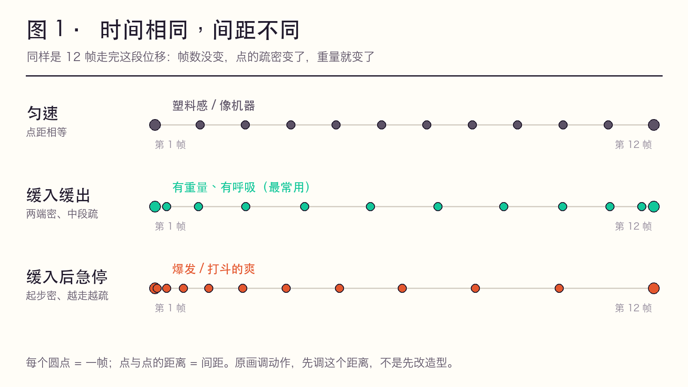
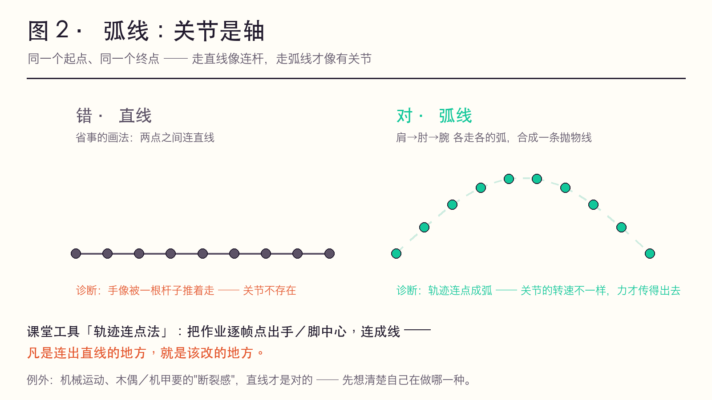
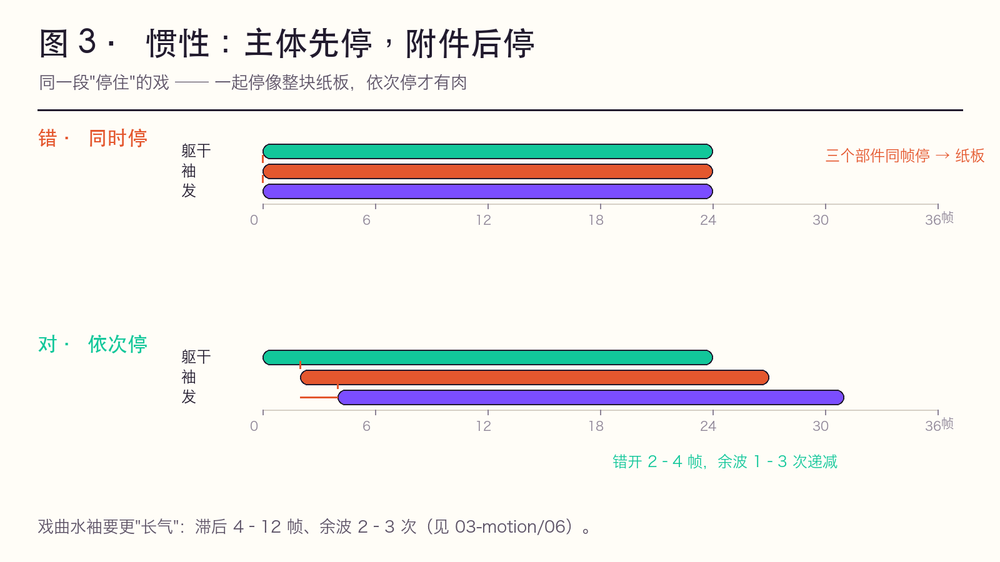
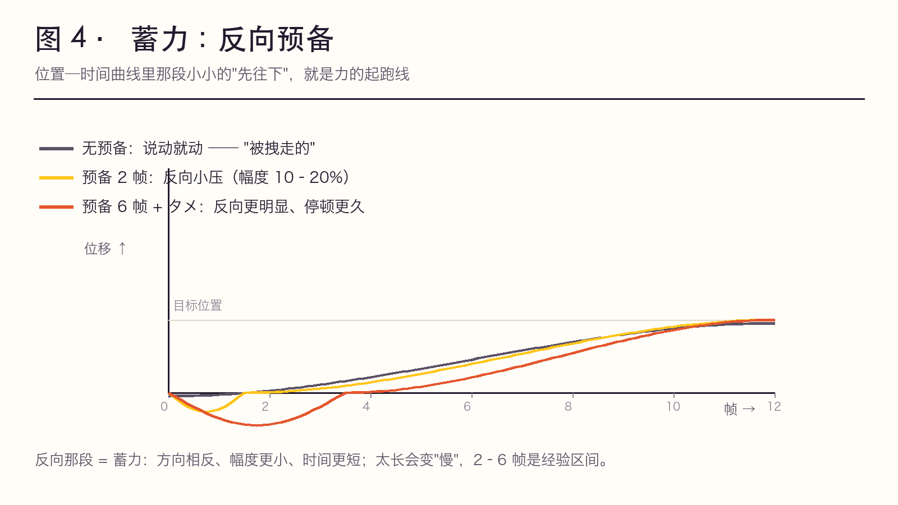

# 原画门诊 · 症状 → 处方（实践问题导向）

> ✅ 实践层。原理层回答「力怎么走」（[02-motion-laws.md](02-motion-laws.md)），**这一页回答「我这段为什么不好看、改哪里」**。
> **用法**：看回放 → 在「症状」栏里找最像的一条 → 按处方拧旋钮 → 用「验证」栏确认改对了。
> **一条铁律**：动作的问题九成出在 **时间、间距、形变** 这三个旋钮上，不在造型上。加帧、重画造型、加特效，都救不了一个错的间距。

---

## 三句话带走

1. **动画不是画动作，是画力的传递。**「蓄力 → 惯性 → 重量感 → 弧线」不是四条并列的规则，是同一条力链上的**四个工位**。
2. **动作不对，先拧旋钮，再谈画技。** 帧数、间距、形变 —— 这三个旋钮没拧过，重画十遍也一样。
3. **物理只保证「对」，这四个工位决定「像人」。** 物理正确是底线，表演个性全在工位之间的取舍里。

---

## 一、四个工位：一条力链，四个观察位置

```
   ① 蓄力          ② 惯性          ③ 重量感        ④ 弧线
  力从哪来   ──▶   力往哪去   ──▶  力有多大   ──▶  力怎么走
  ┌────────┐      ┌────────┐      ┌────────┐     ┌────────┐
  │反向幅度│      │时间差  │      │帧数·间距│     │弯曲半径│
  │＋时长  │      │（错开）│      │·形变    │     │        │
  └────────┘      └────────┘      └────────┘     └────────┘
       ▲                                              │
       └──────── 表演的个性全在这四格里 ──────────────┘
              （物理只管「对」，这四格管「像人」）
```

| 工位 | 回答什么 | 可操作旋钮 | 口诀 | 详解在 |
|------|----------|-----------|------|--------|
| ① **蓄力**<br>预备动作 | 力从哪来 | 反向的**幅度 + 时长** | **要往右，先往左；要往高，先蹲低** | [02-motion-laws](02-motion-laws.md) 三段式 · [01-twelve-principles](01-twelve-principles.md) 法则 2 |
| ② **惯性**<br>跟随与重叠 | 力往哪去 | 主体与附件的**时间差** | **主体先停，附件后停** | [02-motion-laws](02-motion-laws.md) 规律 7 · [03-motion/06](../03-motion/06-cloth-hair-sleeve.md) |
| ③ **重量感** | 力有多大 | **帧数 × 间距 × 形变**（三旋钮） | **先有形变，才有位移** | [03-timing-spacing](03-timing-spacing.md) · [04-frame-recipes](04-frame-recipes.md) |
| ④ **动作弧线** | 力怎么走 | 轨迹的**弯曲半径** | **关节是轴，弧线是关节的走法** | [02-motion-laws](02-motion-laws.md) 规律 6 · [01-twelve-principles](01-twelve-principles.md) 法则 7 |

> **重量的三个旋钮**（记住这张表，比记十条规律有用）：
>
> | 旋钮 | 轻 | 重 |
> |------|-----|-----|
> | 帧数 | 少 | 多（且**不均匀**） |
> | 间距 | 密而匀 | 两端密、中段疏（慢起—突快—缓收） |
> | 形变 | 几乎无 | 接触帧明显压扁、离地帧拉长 |
>
> **学生画不出重量，九成是只改了造型（画得"笨重"），三个旋钮一个没动。**

---

## 二、图证（四张教学图，可直接投屏）

全部为**原创示意图**：参数按本页表格生成，不含任何影片帧 —— 可自由用于课堂、可公开、可改数值重绘（脚本见 [../frames/README.md](../frames/README.md)）。

**图 1 · 间距：时间相同，间距不同** —— 都是 12 帧走完这段位移，帧数没变，点的疏密变了，重量就变了。



**图 2 · 弧线：关节是轴** —— 同一个起点与终点，直线像连杆，弧线才像有关节。



**图 3 · 惯性：主体先停，附件后停** —— 三个部件同帧停像纸板，依次停才有肉。



**图 4 · 蓄力：反向预备** —— 位置—时间曲线里那段"先往下"，就是力的起跑线。



| 图 | 用来讲哪个工位 | 一句话投屏解说 |
|----|---------------|----------------|
| 图 1 | ③ 重量感 | 「帧数一样，为什么这版更重？因为间距不一样。」 |
| 图 2 | ④ 弧线 | 「连点成线，凡直线处就是要改的地方。」 |
| 图 3 | ② 惯性 | 「一起停，就是纸板；依次停，才有肉。」 |
| 图 4 | ① 蓄力 | 「先反着走一点点，动作才是自己动的。」 |

---

## 三、门诊表（主表：对着回放找症状）

| 症状（回放里看到的） | 病因（哪个工位） | 处方（具体怎么改） | 验证（怎么确认改对了） |
|---------------------|-----------------|-------------------|----------------------|
| 轻飘飘、像纸片；落地没有「沉」一下 | ③ 重量感 | ① 接触帧压扁 2–3 帧、离地帧拉长；② 间距改成「慢起—突快—缓收」；③ 落地加 1–2 次递减反弹（幅度约 40% → 15%） | 涂黑看剪影：落地读得出「沉」吗；落地后有没有 1–2 帧的「定」 |
| 像机器人 / 塑料模型 | ④ 弧线 + 间距匀速 | ① 把四肢末端的轨迹逐帧连点，凡直线改弧；② 间距两端密、中段疏 | 把轨迹点连成线，应是弧/抛物线，不是折线 |
| 说动就动，没有气势（"被拽走的"） | ① 蓄力 | 反向预备 **2–6 帧**（幅度 10–20%）；要炸的戏改用 **タメ hold 6–12 帧** | 截起势前那一帧给同学看，能不能说出"她要往哪动" |
| 一停就死 / 像被定住 / 收尾像贴图 | ② 惯性 | 附件**依次**停：躯干 → 袖 → 发，各错开 **2–4 帧**；停稳后留 1 次余波 | 最后一帧里，**是否还有一件东西在动** |
| 打上去没劲、没有反作用力 | ③④ | 接触帧加形变；打完的手/兵器**回弹 2–3 帧** | 打完那只手有没有「回一点」 |
| 幅度都用满了，反而假、反而吵 | ①（过量） | 戏曲/近景：幅度压到 **40–60%**，把夸张挪到**节奏与轨迹**上（幅度不变，快慢对比拉大） | 幅度是否只在该"大"的那一拍用满 |
| 循环动作（走/跑）越看越别扭 | ③ | 一个循环内做**节奏不均**：不是 24 帧平均分，而是「快—慢—极快—顿」 | 逐格看间距，是否每两帧都一样远 |

> 上表里凡是标「②/③/④」的处方，都能在 [06-workflow/02-self-check.md](../06-workflow/02-self-check.md) 的层面 2（动作与节奏 9 项）里逐条打钩复核。

---

## 四、四个工位的课堂讲法（各 5 分钟）

| 工位 | 一句话定义（板书用） | 学生必踩的坑 | 课堂正反例（当场演示） |
|------|--------------------|-------------|---------------------|
| ① 蓄力 | 蓄力不是「停一下」，是**方向相反、幅度更小、时间更短**的力 | 预备做得和主动作同向 → 变成"分两次做" | 抬右手：只抬 vs 先微微下压 3 帧再抬 —— 后者"自己动的" |
| ② 惯性 | 力没有开关，只有**衰减**；主体的力会「漏」到附件上 | 所有部件同时起、同时停 → 整块纸板 | 同一段停住：所有部件同帧停 vs 袖/发依次停 |
| ③ 重量感 | 重量不是画得笨重，是**时间、间距、形变**三旋钮拧出来的 | 只改造型、只会加帧 | 同样一个「坐下」：一拍二匀分 vs 混用（落座一拍三 + 起势一拍一） |
| ④ 弧线 | 现实里没有脱离关节的运动；**直线只属于机械** | 为了省事画直线、画折线 | 挥手：直线往返 vs 肩→肘→腕各走各的弧 |

---

## 五、防拷问 QA（预判学生会问的）

**Q1：为什么蓄力非得「反着来」？**
A：因为力需要一个「起跑线」。同向的准备只是在做动作的一半，观众看到的是"被拽走的"；反向的蓄力让观众**预期**到动作方向 —— 预期被满足 = 有力量感。戏曲里这叫**欲左先右、欲上先下**，是同一个东西的两种语言。

**Q2：我已经加了很多帧，为什么还是轻？**
A：你加的是**时间**，没改**间距**和**形变**。加帧只把动作变长。轻 → 重的最小改动顺序：先改间距（两端密中段疏）→ 再在接触帧压扁 → 最后才考虑加帧。

**Q3：弧线为什么不能画直线？**
A：直线只在两种情况成立：**机械运动**，或你要故意做**断裂感/机械感**（如木偶、机甲）。其余情况下，直线是"没有骨架"的证据 —— 因为人体末端永远绕关节转动。

**Q4：袖子/头发「依次停」到底错开几帧？**
A：经验值 **2–4 帧**一档，整段余波 **1–3 次**递减。戏曲的水袖要更"长气"：滞后可到 **4–12 帧**，余波 2–3 次（见 [03-motion/06](../03-motion/06-cloth-hair-sleeve.md)）。错开越多，布料越"重"且越"飘"。

**Q5：AI 不是已经能自动补间了吗？这些不都能自动？**
A：AI 补的是**物理正确**，不补**表演个性**。这四格里「蓄多长算蓄够」「弧弯到什么程度」「袖子错开 2 帧还是 4 帧」是**选择**，不是物理必然 —— 凡是被当成物理量去算的，AI 都会；凡是要做取舍的，都还在人手里。**四格里的取舍，就是原画这个岗位的不可替代部分。**

---

## 六、课堂练习（对比实验，各 20 分钟）

1. **只动一个旋钮**：同一段「拾物起身」，画三版 —— 只改帧数 / 只改间距 / 只改形变，并排播。让学生说出哪一版最"重"。（答案：间距那版最明显）
2. **蓄力 0 / 2 / 6 帧**：同一次"扑出去"，三版对比，投票哪版有气势，再看 6 帧版是不是"慢了"——引出"预备要短"。
3. **同时停 vs 依次停**：同一段停住动作两版，涂黑看剪影，谁像"有肉的人"。
4. **轨迹连点法**：把自己上一版作业逐帧标出手部中心点，连成线 —— 凡是直线的地方就是该改的地方。

---

## 七、出处与核验

| 内容 | 级别 | 出处 |
|------|------|------|
| 预备、跟随重叠、弧线、缓入缓出 | ✅ 原理层 | Thomas & Johnston《The Illusion of Life》(1981)，中译本《生命的幻象》方丽译，中国青年出版社 2011，ISBN 9787500697459 |
| タメ / ツメ / 抜き / 緩急 | ✅ 原理层 | 日语原画行业术语，见 [03-timing-spacing.md](03-timing-spacing.md) |
| 欲左先右、欲上先下；亮相 | ✅ | 戏曲身段程式，见 [02-motion-laws.md](02-motion-laws.md) 第四节 |
| 中国动画教学体系里的"动作规律" | ✅ | 严定宪《动画技法》，见 [../05-china/02-yan-dingxian.md](../05-china/02-yan-dingxian.md) |
| 具体片例的镜头与作者归属 | ⚠️ | 引用前先查 [sakugabooru](https://www.sakugabooru.com/)，见 [../references/sourcing-log.md](../references/sourcing-log.md) |

> 本页的帧数区间（2–6 / 2–4 / 4–12 帧等）是**教学经验值**，随角色体型、打数与风格浮动，不是硬标准 —— 用它当起点，用回放验证。
