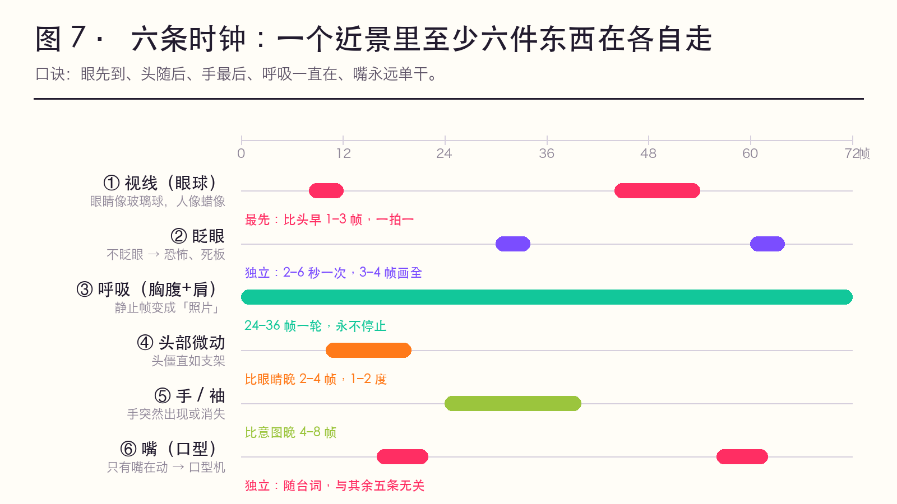
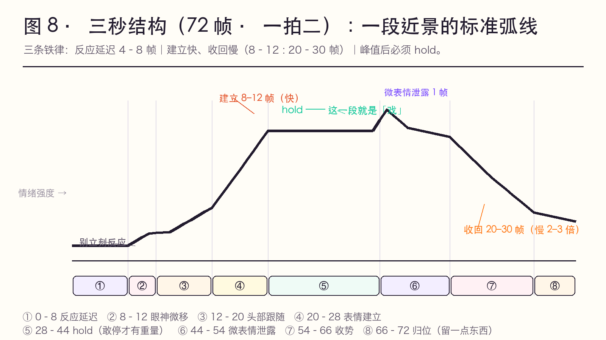

# 近景表演清单：六条时钟 + 三秒结构

> ✅ 经验层，行业通用做法。这一页是可以贴在工位上的**操作清单**。

---

## 一、核心概念：六条时钟（Six Clocks）

一个近景里，至少有六件东西在**以不同的节奏**运动。**它们不是一件东西。**

| # | 时钟 | 周期 | 与主体错拍 | 忘了画的后果 |
|---|------|------|-----------|--------------|
| 1 | **视线（眼球）** | 2–4 帧一次 | **最先**（比头早 1–3 帧） | 眼睛像玻璃球，人像蜡像 |
| 2 | **眨眼** | 3–4 帧一次，间隔多为 2–6 秒 | 独立 | 不眨眼 → 恐怖/死板 |
| 3 | **呼吸（胸腹+肩）** | 24–36 帧一次 | 独立，永不停止 | 静止帧变"照片" |
| 4 | **头部微动** | 微小、1–2 度 | 比眼睛晚 2–4 帧 | 头僵直如支架 |
| 5 | **手/袖** | 随情绪 | 比意图晚 4–8 帧 | 手突然出现/消失 |
| 6 | **嘴（口型）** | 随台词 | 独立 | 只有嘴在动 → "口型机" |

> **一句口诀**：**眼先到、头随后、手最后、呼吸一直在、嘴永远单干。**

---

## 图证（两张教学图）

**图 7 · 六条时钟的错拍时间轴** —— 一个近景里六件东西在各自走；错拍就是「活」，齐动就是「木偶」。

**图 8 · 三秒结构（72 帧）** —— 反应延迟 → 眼神 → 头 → 建立 → hold → 泄露 → 慢收回 → 归位。

| 图 | 用来讲什么 | 一句话投屏解说 |
|----|-----------|----------------|
| 图 7 | 错拍 | 「不是一件东西在动，是六件 —— 一起动就是木偶。」 |
| 图 8 | 反应延迟与 hold | 「别立刻反应；到了峰值，敢停。」 |

---

## 二、三秒结构：一段近景的标准弧线

以"听到一句令人心动的话"为例，共 72 帧（3 秒，一拍二）：

| 帧 | 阶段 | 做什么 |
|----|------|--------|
| 0–8 | **反应延迟** | 不动（只呼吸）。**不要立刻反应**——这 8 帧是"听见了" |
| 8–12 | **眼神微移** | 眼球移向说话者/移开（1–2 帧，一拍一） |
| 12–20 | **头部跟随** | 头转向，滞后视线 2–4 帧；发饰随后晃 3–4 帧 |
| 20–28 | **表情建立** | 微表情闪 1 帧（吸气、眼皮一紧）→ 半幅度表情落定 |
| 28–44 | **hold（表演的停留）** | 保持，只留呼吸与一次眨眼。**这一段是"戏"** |
| 44–54 | **微表情泄露** | 插入 1–2 帧的无意识泄露（嘴角一动、喉结一动、吸半口气） |
| 54–66 | **收势** | 表情收回，收回速度比建立**慢 2–3 倍** |
| 66–72 | **归位** | 回到起始状态但**不完全一样**（眼神留了一点东西） |

**三条铁律**：
1. **反应延迟 4–8 帧**（0.17–0.33 秒）。这是业余与专业最大的分水岭。
2. **建立快、收回慢**。建立 8–12 帧，收回 20–30 帧。
3. **峰值后必须 hold**。一到表情峰值就切镜＝表演被腰斩。

---

## 三、近景专用的十个"小动作"（真感零件）

| 零件 | 做法 | 适用情绪 |
|------|------|----------|
| 眨眼变慢 | 间隔从 3 秒拉到 5–6 秒 | 心动、要哭、出神 |
| 吞咽（喉结/颈部） | 1 帧的喉动 | 紧张、忍、动情 |
| 吸气半口 | 鼻翼微开 1–2 帧 | 惊讶前的预备、下决心 |
| 视线游移 | 眼球小幅无目的移动 | 思考、心乱（杜丽娘"春情难遣"） |
| 视线下移 | 眼球向下 2–3 帧再抬起 | 羞、愧疚、认输 |
| 单侧抬嘴角 | 只一侧，2 帧 | 会心、苦笑、自嘲 |
| 眉心一闪 | AU4 半幅度 1–2 帧 | 隐痛、想不通 |
| 下唇内收 | AU17，2 帧 | 忍住、倔、要哭 |
| 头侧倾 | 3–5 度，缓慢 | 疑问、亲昵、专注 |
| 出神（焦点丢失） | 眼皮微垂、瞳孔不对焦，持续 12–24 帧 | 怅惘、回忆 |

> 这张表就是杜丽娘「游园」后近景的**全部弹药**。戏曲的"含而不露"，在动画里不是"不做表情"，而是**只用这张表里的零件，绝不用大表情**。

---

## 四、镜头与表演的配合

| 景别 | 表演尺度 | 帧数倾向 | 备注 |
|------|----------|----------|------|
| 远景/全景 | 动作大、身体为主 | 一拍二/三 | 面部交给"身体线" |
| 中景 | 手势 + 半身 | 一拍二 | 手是主要表演器官 |
| **近景** | **微表情 + 视线 + 呼吸** | **关键帧一拍一，其余一拍二** | 本节主战场 |
| 大特写（眼） | 瞳孔、睫毛、泪膜 | 一拍一 | 一次眨眼要 3–4 帧画全 |

**近景与剪辑**：近景的"表演时间"比全景长。如果按全景的节奏切近景，近景会来不及演完 → 观众感觉"没演出什么就过去了"。**近景要给它 1.5–2 倍的时间。**

---

## 五、课堂练习

1. **六条时钟拆解**：放一段 5 秒近景，逐格写六条时钟各自的帧表。
2. **反应延迟对照**：同一句台词，做"立刻反应"与"延迟 8 帧"两版，录下来比。
3. **只给零件**：禁止使用大表情，只用第三节的十个零件，做一段 3 秒的"心动"。
4. **hold 练**：在表情峰值处 hold 12 帧，感受"敢停"带来的表演重量。
